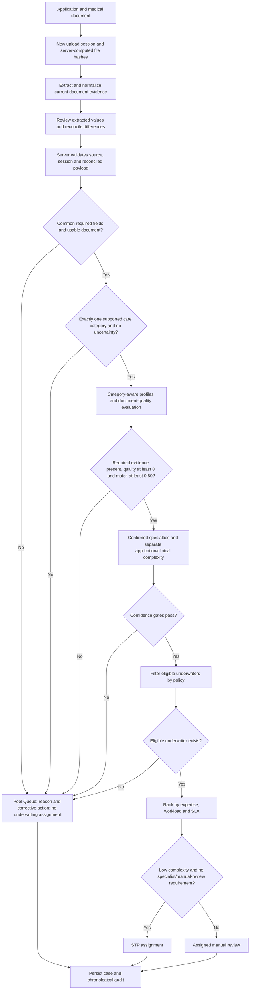

# AI-UD integrated mentor demo: implementation and acceptance plan

Prepared 9 September 2026 against app HEAD `fa637db` and the existing uncommitted Label Review/evaluation work. Input context: `/Users/quocbaohaminh/Downloads/context(1).md`. The supplied context describes the intended behavior; this report distinguishes it from verified implementation. No application logic was changed during this planning review.

## 1. Confirmed demo scope

The updated context returns the product to **life-insurance application dispatch using medical-document evidence**. The outcome is assignment to a suitable underwriter, or a clearly explained human-review queue. It is not a claim-payment decision or approval of insurance coverage.

Keep document quality (0–10) separate from case complexity (1–10). A high-quality document may describe a difficult case. Document quality controls whether the evidence can be processed; complexity and specialist needs control who should review it.

**User confirmed: keep the strict single-category gate.** Infer all supported Inpatient/Outpatient/Dental categories for the submitted medical episode or explicit bundle, excluding unrelated historical mentions. Exactly one supported category with no unresolved uncertainty may continue. Zero, two or three supported categories, or any unresolved category uncertainty, go to Pool Queue before complexity scoring and underwriter matching.

Medical reference profiles support quality/applicability checks within the confirmed category. They do not replace the strict gate, and a highest-scoring profile must never hide overlap. Inpatient is not synonymous with surgery; outpatient surgery does not establish admission. Dental alone does not imply a separate Outpatient category, while explicit outpatient dental care can support both under the existing reviewed policy.

The mentor story is **life-insurance application dispatch with a strict classification gate for its submitted medical evidence**. This is a deliberate constraint on evidence processing, not a claim that a person or policy can have only one kind of care. Explain that mixed submitted episodes go to human review under this pilot policy.

## 2. Proposed integrated flow

The strict category gate sends failures directly to Q; it is not a forced-choice classifier. UI display order can remain Case Scoring → NER → Document Quality while processing enforces the quality gate first. Blocked cases may display clearly marked preliminary evidence, but must not claim completed underwriting or assignment.

Use distinct state fields for document validation, routing reason, underwriting evaluation, assignment, and resolution. A valid document means **eligible for subsequent checks**, not `AUTO_ASSIGN`. Ordinary incompleteness should not be labelled a high-risk escalation.

## 3. What is already implemented

- TXT, DOCX and a limited selectable-PDF text extraction layer; an optional Gemini extraction path.
- A ten-dimension document-quality evaluator, partial/missing field lists, contradiction codes, content-based profile matching and confidence indicators.
- Application and clinical complexity components with a weighted final score.
- Upload-session IDs, browser file hashing, rejection of stale extraction responses, and marked document additions to application text.
- Server re-extraction for the normal UI file submission path.
- Policy filtering, assignment, Pool Queue, manual override, rerouting, case detail and local audit storage.
- Label Review and importable reviewed references: 37 short synthetic service-category cases, separate from the application-processing pipeline.

These features exist, but their composition does not yet satisfy the complete updated flow.

## 4. Verified blockers and integration gaps

| Priority | Finding | Evidence and required adjustment |
|---|---|---|
| P0 | Incomplete applications can be assigned | Offline pipeline probe with blank occupation/history and no document returned `ASSIGNED_STP` with three missing-field warnings. Make required-field failures terminal. Define explicitly which application-only submissions are permitted, if any. |
| P0 | Matching precedes a failed quality gate | An unreadable synthetic document scored 0, produced a proposed underwriter, and attempted the solver before its final assignee was cleared. Short-circuit before filtering/optimization and external calls. |
| P0 | Override can bypass quality failure | Applying the existing override to that case returned `ASSIGNED_MANUAL` while quality remained FAILED. Distinguish assigning an operations remediation owner from assigning an underwriter; require corrected evidence and reevaluation before underwriting assignment. |
| P0 | File hash is trusted from the client | `extractDocuments` uses `file.sourceFileHash ?? hashUploadedFile(file)` for its cache. Two different test contents carrying the same claimed hash returned the first document's text. Always compute the hash server-side, compare any supplied hash, and bind cache keys to all effective inputs, including OCR text, MIME/parser version and extraction mode. |
| P0 | Specialty extraction ignores document diagnoses | Structured General Surgery/acute appendicitis evidence produced no confirmed specialties in the fallback. Conversely, `No diabetes. No cancer. No cardiac disease.` produced three confirmed specialties. Extract from grounded, non-negated clinical evidence and relevant application history, preserving source and temporal context. Align specialist vocabulary with the registry. |
| P0 | Static checks fail | Type-check reports four errors in `test/fixtures.test.ts`: old complexity fixtures lack component scores/confidence/evidence, and NER fixtures lack confidence. Update complete test builders and retain meaningful branch assertions. |
| P1 | Required evidence has inconsistent outcomes | A synthetic record without diagnosis/coding scored 9 and returned PASSED plus `MISSING_REQUIRED_FIELDS`; the pipeline subsequently reduces confidence. Define one shared required-evidence predicate and show the same result in quality, routing and explanations. |
| P1 | Category/profile contract differs | The quality evaluator picks one weighted profile; the reviewed category evaluator preserves overlap and uncertainty. The latter is not called by submission processing. Use the confirmed strict contract in section 1 when adding the adapter; profile matching cannot override it. |
| P1 | Application score is influenced twice by document evidence | `scoreComplexity` floors application complexity to 5 for surgical/hospital evidence, before blending clinical complexity. Marked document text may also enter application-history scoring. Remove double counting or explicitly document and test a deliberate scoring-policy change. Show the actual weighted formula, not a misleading addition. |
| P1 | File replacement and removal need full lifecycle tests | Picking a different filename adds a file rather than replacing the previous one. Clearing document blocks does not restore scalar fields previously accepted from a document. Removing the last file during extraction returns early without clearing the loading flag. Add explicit Add/Replace behavior, source-aware field restoration, and race-safe reset logic. |
| P1 | Server trust remains incomplete | The compatibility path accepts sanitized client extractions; the upload path accepts supplied OCR text and does not fully bind top-level session to every file. Re-extraction alone does not authenticate user-edited evidence. Disable the compatibility path for demo auto-assignment or require an explicit unverified/manual-only route. |
| P1 | Failure under configured Gemini is not the same as offline mode | The extraction catch path returns empty fields even when local text was readable. Run deterministic extraction when Gemini fails; preserve provider/source warnings without falsely treating readable content as an extraction failure. |
| P1 | Profiles and confidence are heuristic | Current “semantic match” is weighted regular-expression signal matching plus structural completeness, and evaluator confidence uses fixed heuristic values. Describe them accurately; do not claim calibrated probabilities, embeddings or dataset-trained inference. Test negation, historical statements, overlapping profiles and threshold precision. |
| P1 | Display states can disagree | A quality pass sets document route `AUTO_ASSIGN` before confidence/policy decisions. The header suppresses Pool Queue reasons unless quality itself failed. Show actual final reasons for confidence, policy and availability blocks. |
| P1 | Seeded walkthrough differs from live intake | `lib/seed.ts` explicitly sets `documentQuality: null` and creates its own routing outcome. Generate mentor scenarios through the shared deterministic evaluator from real synthetic document content. Keep old snapshots clearly marked if retained. |

Also inspect contradiction aggregation across multiple files: the current merge overwrites earlier fields and may hide patient, date or billing disagreements. A consistent synthetic document should not borrow missing evidence from an unrelated patient's file.

## 5. Integration work packages

### A. Freeze the business and data contract

- Implement the confirmed strict service-category gate; keep the existing approved review export immutable.
- Define mandatory application fields separately from medical-document evidence. Define whether a document is optional for any specific product/profile.
- Use a typed, versioned policy configuration for quality threshold 8, semantic threshold 0.50, confidence threshold 0.75, required evidence and profile applicability.
- Keep application data, reconciled scalar decisions, document evidence and calculated outcomes separate. Every document field needs a source file/session and extraction or user-edit provenance.

### B. Fix ingestion and sessions

- Recompute hashes, reject stale sessions, handle OCR input provenance and prevent extraction-cache collisions.
- Implement explicit replace/add/remove behavior and preserve only current evidence.
- Make local extraction the recovery path for an unavailable model. Scanned pages with no OCR should fail visibly offline; offline does not mean fabricated OCR success.
- Do not silently auto-merge clinical findings into application scoring inputs on direct/API paths.

### C. Unify scoring, gates and actions

- Implement shared pure functions for required fields, applicability, quality, specialty evidence, complexity, confidence and final route.
- Document quality: ten dimensions with COMPLETE=1, PARTIAL=0.5, MISSING=0. Use one documented not-applicable denominator rule; make caps and penalties reconcile exactly to the displayed total.
- Case complexity: preserve application-only factors; calculate clinical factors separately; use `round(0.4 × application + 0.6 × clinical)` when sufficient document evidence exists. Do not inflate an input score merely to achieve the presentation's example output.
- Run matching only after all mandatory gates pass. Use specialist requirements as well as complexity when choosing STP versus manual review.
- Apply the same gate contract to rerouting, overrides and resolution. Preserve the reason a case was blocked and distinguish remediation from underwriting assignment.

### D. Connect evaluation without misusing labels

- Keep the 37 approved examples as service-category regression references under their original policy version. They do not label document quality, specialty accuracy, complexity, or final staff assignment.
- Adapt current extracted text/evidence into the strict category gate and test the adapter. Do not replace independent category evidence with the quality evaluator's winning profile. Keep the original quote-grounding checks and record category-policy version on each case.
- Future definition changes require a new versioned review task rather than silently relabelling old approvals.
- Add full synthetic application/document bundles with independently reviewed expected quality fields, specialties, scoring contributions and routes. Keep development and holdout separation.

### E. Prepare the mentor walkthrough

- Keep the current layout: Case Scoring and Basic Information on the left; NER before Document Quality in the right column.
- Show field-level evidence, scores and formulas, confidence limitations, final queue reason, assignment status and audit chronology.
- Use the same intake path for prepared demos and actual file uploads. Explain that persistence is local, roles are demo roles, and notifications are simulated unless a delivery integration exists.
- Defer a full admin prompt/configuration editor until the integrated flow is tested. Versioned configuration in code is the first step; a future UI should support draft → evaluate → activate → rollback.

## 6. End-to-end acceptance matrix

Run deterministic tests with no network, Gemini or solver dependency. Use raw file uploads through extraction and case-processing APIs, then verify the browser workflow and persisted case. API/unit checks alone do not prove browser replacement/reconciliation behavior.

| Scenario | Required outcome |
|---|---|
| Complete low-complexity clinic evidence | Quality passes; STP only if no specialist requirement, sufficient confidence and policies pass. |
| Complete surgical evidence | Quality passes; evidence-based clinical complexity; required surgery specialty; appropriate manual review or explicit no-eligible-specialist queue. |
| Complete dental evidence | Correct oral-health evidence; no automatic assumption of high complexity; explicit category overlap goes to Pool Queue; a Dental-only case continues under specialist policy. |
| Missing common application fields | Pool Queue or clearly rejected intake before scoring/matching; no assignee. |
| Missing required clinical evidence | Same failure in quality, route, reason and UI; no solver attempt. |
| Symptoms only | Unknown/uncertain profile and specialty; no confirmed specialist from symptoms alone. |
| Blank/scanned document without OCR | Unreadable/needs OCR; NOT_EVALUATED; no assignee. |
| Contradictory dates or impossible amounts | Specific contradiction, source fields and itemized penalty; queue when validation fails. |
| Missing/partial/not-applicable fields | Correct buckets; sum, normalization, caps and penalties reproduce displayed score. |
| 7.9 / 8.0 / low confidence | Below 8 always fails; 8 alone never overrides confidence or policy. |
| Multiple or uncertain care categories | Pool Queue before complexity/matching; one confirmed category plus another uncertain category also queues. |
| Negative/historical medical statements | No positive condition or current-service label invented from negation/history. |
| Rename same content / fake reference filename | Identical evidence for renamed bytes; filename does not make fake content pass. |
| Replace complete with incomplete, and reverse | No stale text, accepted scalar values, labels, diagnoses, specialties, scores or errors. |
| Remove final file while extracting | UI stops loading; no old response is accepted or submitted. |
| Changed bytes with reused hash; changed OCR with same bytes | Reject mismatch or freshly evaluate effective input; never reuse another document's evidence. |
| Two patients in one upload bundle | Do not merge their evidence into one apparently complete record. |
| Gemini timeout or malformed response | Deterministic extraction/scoring succeeds where content supports it; engine and limitation visible. |
| Solver unavailable | Eligible assignment uses deterministic fallback; all preceding gates remain enforced. |
| Policy or capacity failure | Accurate reason; no assignee; not hidden by a passing document score. |
| Override/reroute a failed document | Remediation only until revalidated; no bypass to underwriting assignment. |
| Save, reload, review, resolve | Case and chronological audit persist; resolution means workflow completion, not insurance approval. |

Prepare a short walkthrough with five actual uploads: clean clinic, complex surgical, dental, incomplete/contradictory document, and a complete-to-incomplete replacement. Add the no-eligible-underwriter case to demonstrate operational routing. Show each expected result beside the observed result; measure processing time rather than promise the proposal's ROI targets.

## 7. Verification performed during this planning review

- Existing Jest suite: **105 tests passed across 3 suites**.
- Type-check: **failed with four errors in legacy test fixtures**.
- Focused offline runtime probes reproduced: missing-field STP assignment; matching before quality rejection; overriding a failed document; ignored document-only specialty evidence; positive NER from negated conditions; reused evidence under a client-supplied hash; a quality PASSED result with missing required diagnosis evidence.
- These probes used synthetic values, no network, and an unavailable solver stub. They do not constitute medical validation, measured AI accuracy, or a completed browser end-to-end test.
- Production build and full browser acceptance matrix have **not** been verified for this updated checkout. Fix the known type-check failures and integration blockers before declaring mentor-demo readiness.

## 8. Completion criteria

The integration is ready when the confirmed strict category contract is implemented; every mandatory gate is enforced on every entry/action path; the 105 existing tests plus new regression/API/browser checks pass; type-check and production build pass; and all prepared mentor uploads produce their documented outcomes with consistent scores, reasons, assignee state and audit history.

Remaining product limitations should be stated: synthetic reference coverage, heuristic scoring/confidence, limited document parsing/OCR, local-only persistence, demo roles, and no measured production SLA or underwriting outcome accuracy. Fine-tuning and broad admin configuration are follow-on work, not prerequisites for this integration.
